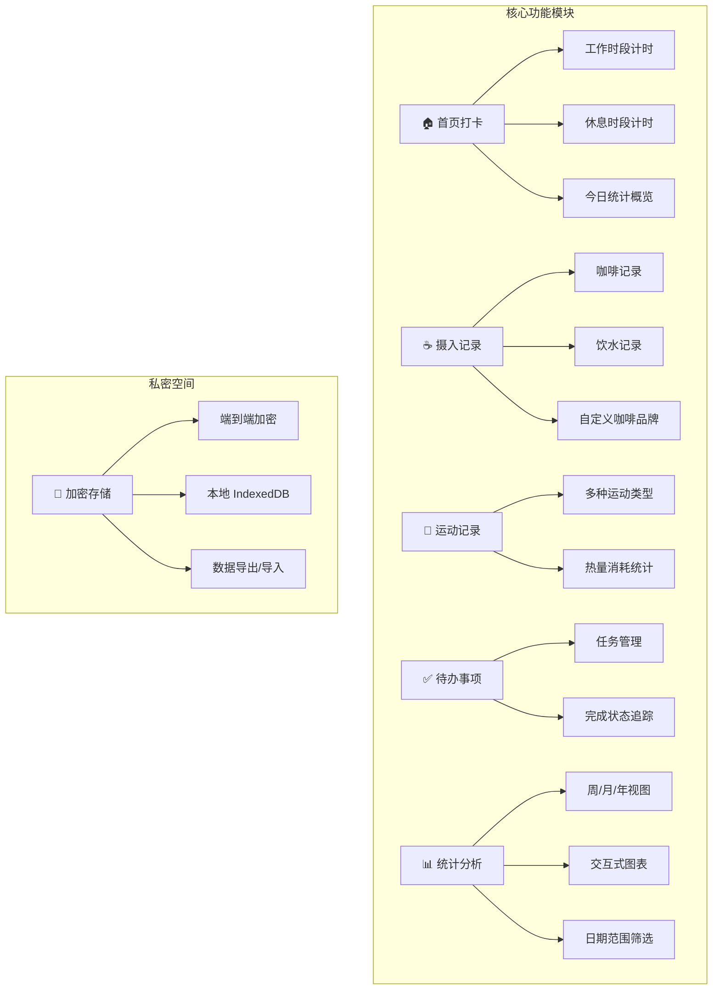
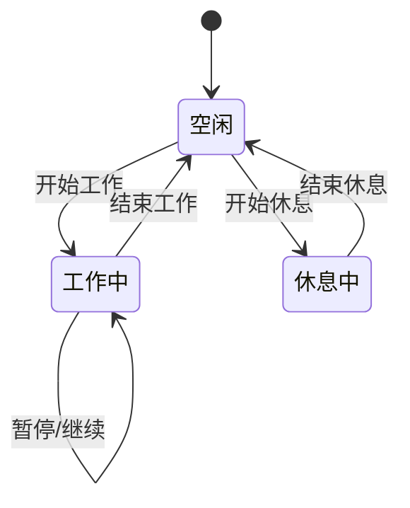
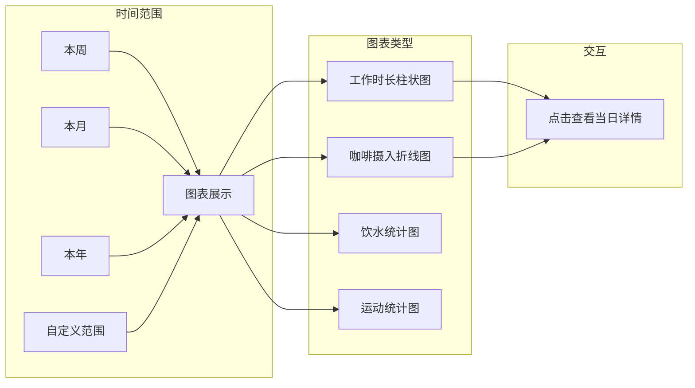
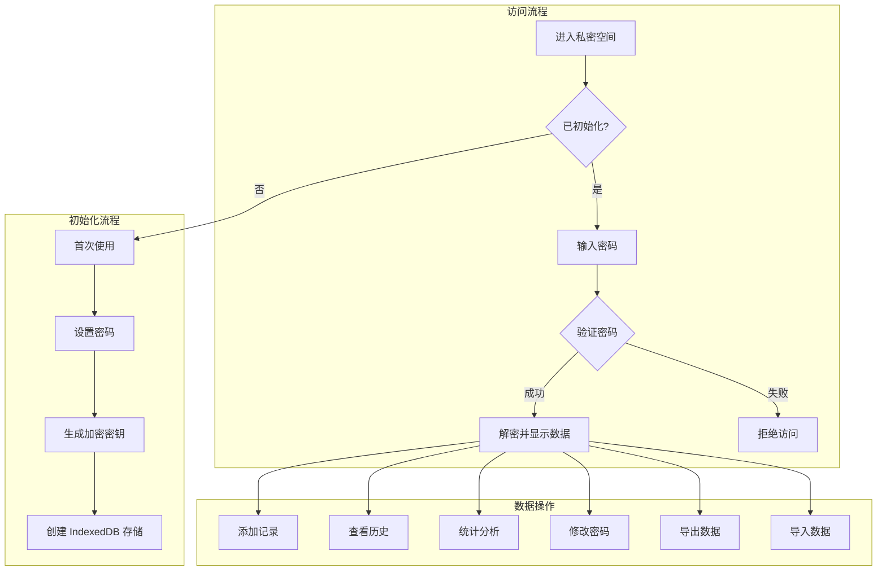
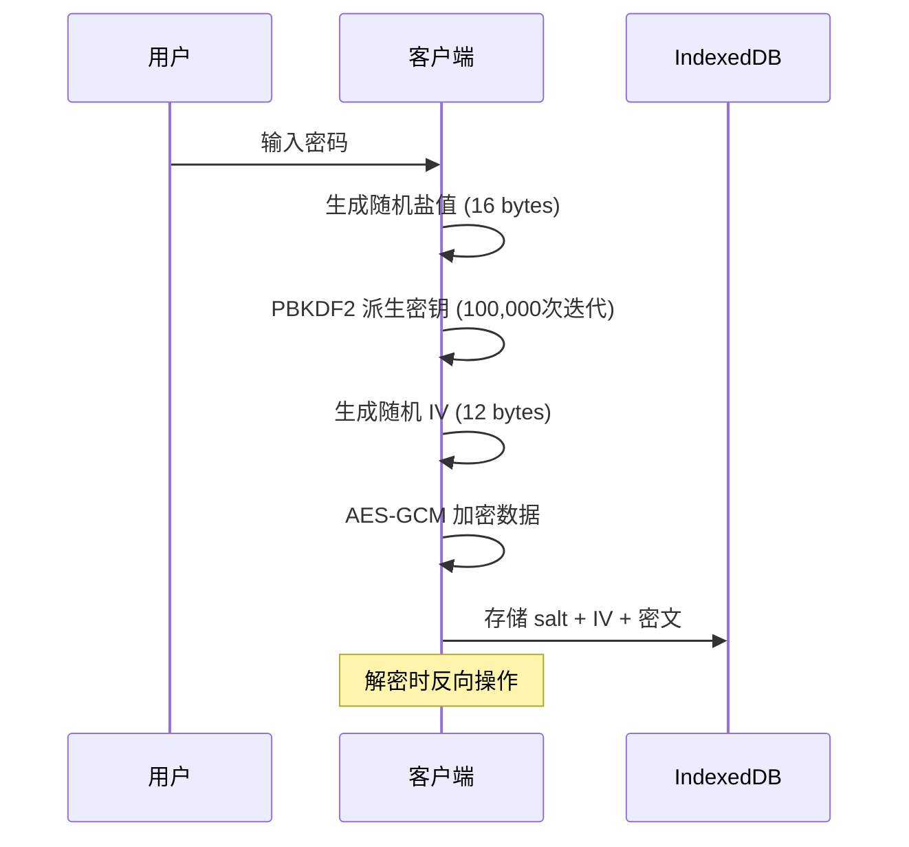
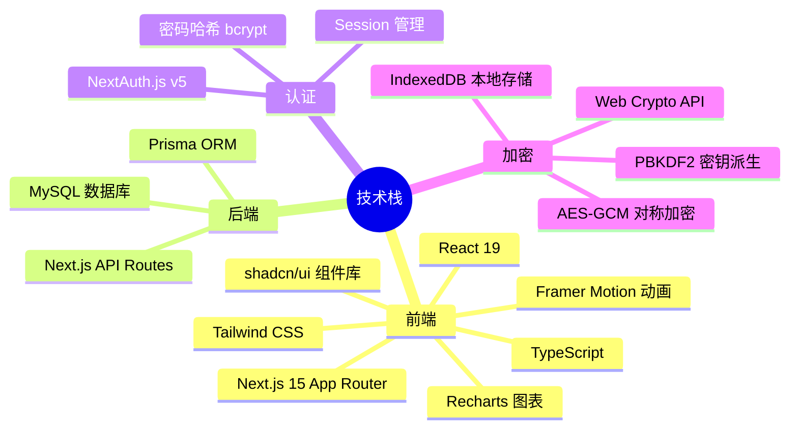
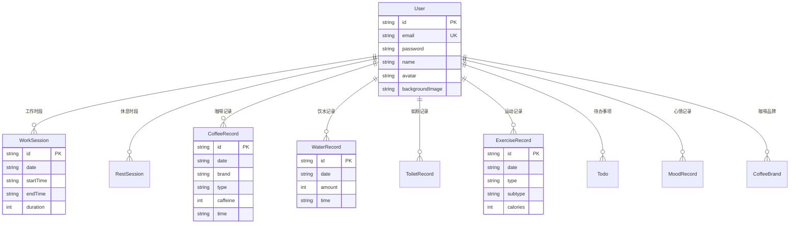
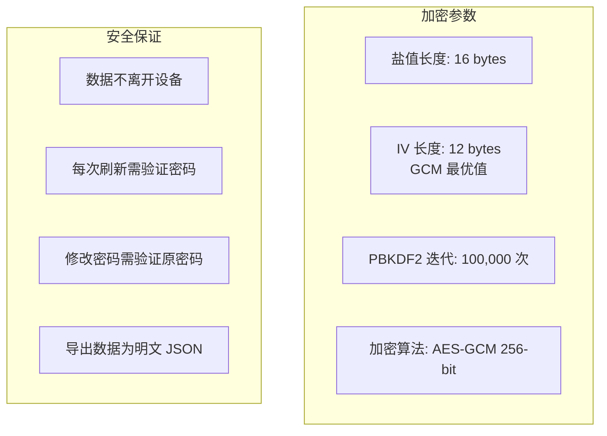
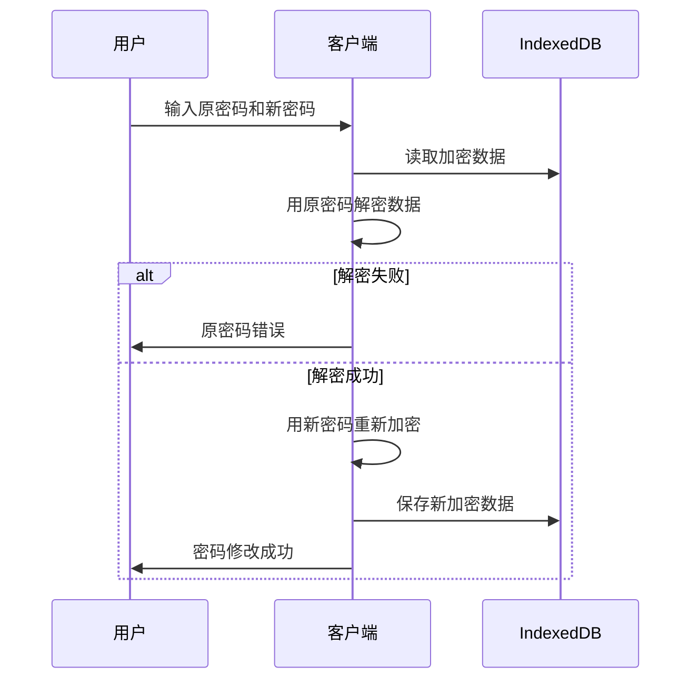

# 研究生自我管理系统

一个基于 Next.js 15 的全栈研究生日常管理应用，帮助追踪工作打卡、饮水、咖啡、运动、如厕、待办事项等，并支持端到端加密的私密空间功能。

## 功能概览



---

## 功能详情

### 🏠 首页打卡

主页面提供工作/休息时段的计时功能，实时显示今日工作时长和休息时长。

| 功能 | 说明 |
|------|------|
| 工作计时 | 开始/暂停/结束工作时段，自动计算时长 |
| 休息计时 | 独立的休息时段计时器 |
| 时段编辑 | 修改已记录时段的开始/结束时间 |
| 今日概览 | 显示今日所有工作/休息时段列表 |



### ☕ 摄入记录

追踪每日咖啡和饮水摄入量，支持自定义咖啡品牌和类型。

**咖啡记录功能：**
- 记录咖啡品牌、类型、咖啡因含量
- 支持自定义咖啡品牌和类型
- 显示今日咖啡摄入总量和咖啡因总量
- 编辑和删除已有记录

**饮水记录功能：**
- 快速记录饮水量（ml）
- 显示今日饮水总量
- 编辑和删除已有记录

### 🏃 运动记录

追踪每日运动情况，支持多种运动类型。

| 运动类型 | 说明 |
|----------|------|
| 跑步 | 可记录距离、时长、消耗热量 |
| 健身 | 力量训练记录 |
| 游泳 | 游泳运动记录 |
| 骑行 | 骑行运动记录 |
| 其他 | 自定义运动类型 |

### ✅ 待办事项

简洁的任务管理功能。

- 添加/编辑/删除任务
- 标记任务完成状态
- 按创建时间排序显示

### 📊 统计分析

多维度数据可视化分析。



**统计指标：**
- 总工作时长、平均每日工作时长
- 总咖啡杯数、总咖啡因摄入量
- 总饮水量、平均每日饮水量
- 总运动次数、总消耗热量

### 🔐 私密空间

端到端加密的私密记录空间，数据仅存储在本地设备。



**安全特性：**

| 特性 | 说明 |
|------|------|
| 端到端加密 | 数据在客户端加密，服务器无法访问 |
| 本地存储 | 数据仅存储在浏览器 IndexedDB 中 |
| 密码验证 | 每次刷新页面需重新验证密码 |
| 强加密算法 | PBKDF2 (100,000次迭代) + AES-GCM 256-bit |

**加密流程：**



---

## 技术架构



### 数据模型



---

## 项目结构

```
├── prisma/
│   └── schema.prisma          # 数据库模型定义
├── public/                     # 静态资源
├── src/
│   ├── app/                   # Next.js App Router
│   │   ├── (dashboard)/       # 需认证的仪表盘页面
│   │   │   ├── page.tsx       # 首页打卡
│   │   │   ├── exercise/      # 运动记录
│   │   │   ├── intake/        # 摄入记录（咖啡/饮水）
│   │   │   ├── private/       # 私密空间
│   │   │   │   ├── page.tsx
│   │   │   │   └── components/
│   │   │   ├── profile/       # 个人资料
│   │   │   ├── stats/         # 统计分析
│   │   │   ├── todo/          # 待办事项
│   │   │   └── toilet/        # 如厕记录
│   │   ├── api/               # API 路由
│   │   │   ├── auth/          # 认证 API
│   │   │   ├── coffee/        # 咖啡 CRUD
│   │   │   ├── water/         # 饮水 CRUD
│   │   │   ├── exercise/      # 运动 CRUD
│   │   │   ├── todos/         # 待办 CRUD
│   │   │   ├── work-sessions/ # 工作时段 API
│   │   │   ├── rest-sessions/ # 休息时段 API
│   │   │   └── stats/         # 统计数据 API
│   │   ├── login/             # 登录页
│   │   ├── register/          # 注册页
│   │   ├── layout.tsx         # 根布局
│   │   └── globals.css        # 全局样式
│   ├── components/
│   │   ├── layout/            # 布局组件
│   │   │   └── DashboardLayout.tsx
│   │   ├── stats/             # 统计图表组件
│   │   │   ├── WorkChart.tsx
│   │   │   ├── CoffeeChart.tsx
│   │   │   ├── SummaryCards.tsx
│   │   │   └── DateRangePicker.tsx
│   │   └── ui/                # shadcn/ui 基础组件
│   ├── hooks/
│   │   └── usePrivateSpace.ts # 私密空间状态管理
│   ├── lib/
│   │   ├── auth.ts            # NextAuth 配置
│   │   ├── prisma.ts          # Prisma 客户端
│   │   ├── encryption.ts      # 加密工具函数
│   │   ├── private-db.ts      # IndexedDB 操作封装
│   │   └── utils.ts           # 通用工具函数
│   ├── middleware.ts          # Next.js 中间件（认证保护）
│   └── types/
│       └── next-auth.d.ts     # NextAuth 类型扩展
├── .env.example               # 环境变量模板
├── package.json
└── tsconfig.json
```

---

## 快速开始

### 环境要求

- Node.js 18+
- npm 或 pnpm
- MySQL 数据库

### 安装步骤

```bash
# 1. 克隆仓库
git clone https://github.com/Echo253/Graduate-self-management-records.git
cd Graduate-self-management-records

# 2. 安装依赖
npm install

# 3. 配置环境变量
cp .env.example .env
```

编辑 `.env` 文件：

```env
# MySQL 数据库连接
DATABASE_URL="mysql://用户名:密码@主机:端口/数据库名"

# NextAuth 密钥（运行以下命令生成）
# openssl rand -base64 32
AUTH_SECRET="你的随机密钥"
```

```bash
# 4. 初始化数据库
npx prisma db push

# 5. 启动开发服务器
npm run dev
```

访问 http://localhost:3000 开始使用。

---

## API 接口

### 认证相关

| 方法 | 路径 | 说明 |
|------|------|------|
| POST | `/api/auth/register` | 用户注册 |
| POST | `/api/auth/[...nextauth]` | NextAuth 处理 |

### 数据 CRUD

| 方法 | 路径 | 说明 |
|------|------|------|
| GET/POST | `/api/coffee` | 获取/创建咖啡记录 |
| GET/PUT/DELETE | `/api/coffee/[id]` | 操作单条咖啡记录 |
| GET/POST | `/api/water` | 获取/创建饮水记录 |
| GET/PUT/DELETE | `/api/water/[id]` | 操作单条饮水记录 |
| GET/POST | `/api/exercise` | 获取/创建运动记录 |
| GET/PUT/DELETE | `/api/exercise/[id]` | 操作单条运动记录 |
| GET/POST | `/api/todos` | 获取/创建待办事项 |
| GET/PUT/DELETE | `/api/todos/[id]` | 操作单条待办 |
| GET/POST | `/api/work-sessions` | 获取/创建工作时段 |
| GET/PUT/DELETE | `/api/work-sessions/[id]` | 操作单条工作时段 |
| GET/POST | `/api/rest-sessions` | 获取/创建休息时段 |
| GET | `/api/stats` | 获取统计数据 |

### 统计 API

```typescript
// GET /api/stats?period=week|month|year
// 或 GET /api/stats?startDate=2024-01-01&endDate=2024-01-31

interface StatsResponse {
  dateRange: { startDate: string; endDate: string }
  workSessions: { date: string; duration: number }[]
  coffeeRecords: { date: string; count: number; caffeine: number }[]
  waterRecords: { date: string; amount: number }[]
  exerciseRecords: { date: string; count: number; calories: number }[]
}
```

---

## 安全设计

### 用户认证

- 使用 NextAuth.js 进行会话管理
- 密码使用 bcrypt 哈希存储
- 所有仪表盘页面受中间件保护

### 私密空间加密



**修改密码流程：**



---

## 部署

### 云服务器部署

```bash
# 构建
npm run build

# 使用 PM2 管理
pm2 start npm --name "graduate-management" -- start
```

### Docker 部署

```dockerfile
FROM node:20-alpine
WORKDIR /app
COPY package*.json ./
RUN npm ci
COPY . .
RUN npx prisma generate && npm run build
EXPOSE 3000
CMD ["npm", "start"]
```

---

## 许可证

MIT
