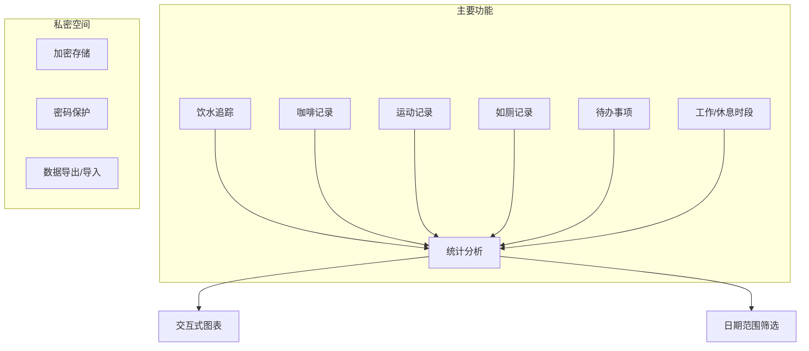
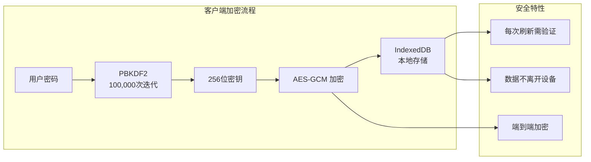
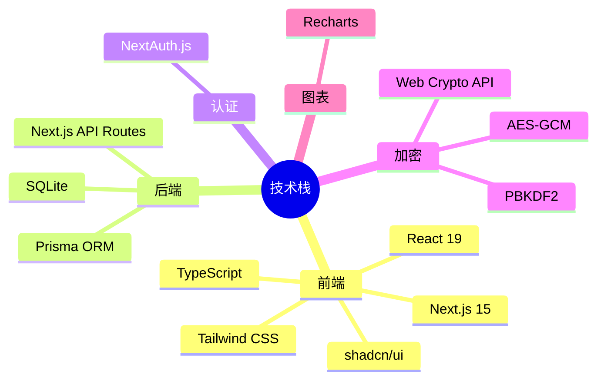
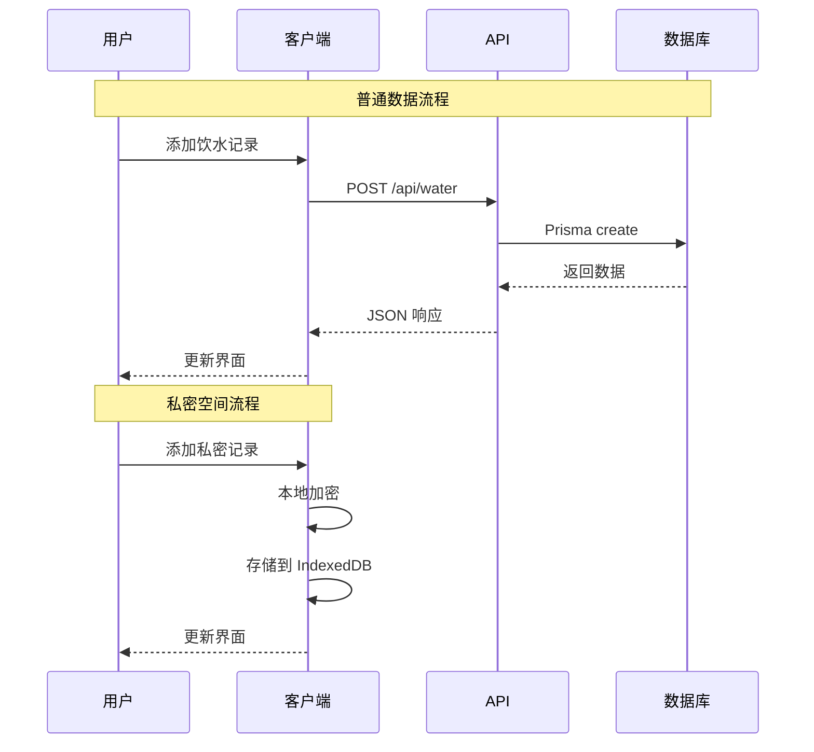
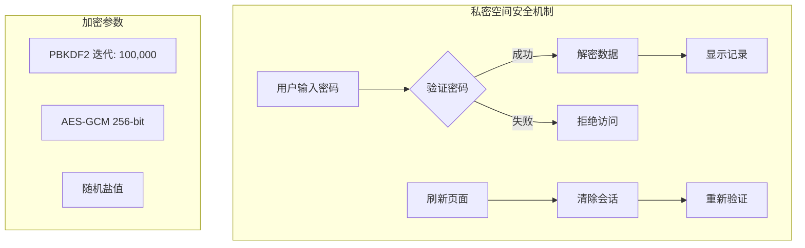

# 研究生自我管理系统

一个基于 Next.js 15 的全栈研究生日常管理应用，帮助追踪饮水、咖啡、运动、如厕、待办事项等，并支持私密空间功能。

## 功能特性

### 📊 核心功能模块



### 🔐 私密空间架构



## 技术栈



## 项目结构

```
├── prisma/                 # 数据库模型
│   └── schema.prisma
├── public/                 # 静态资源
├── src/
│   ├── app/               # Next.js App Router
│   │   ├── (dashboard)/   # 仪表盘页面
│   │   │   ├── exercise/  # 运动记录
│   │   │   ├── intake/    # 饮水/咖啡
│   │   │   ├── private/   # 私密空间
│   │   │   ├── stats/     # 统计分析
│   │   │   ├── todo/      # 待办事项
│   │   │   └── toilet/    # 如厕记录
│   │   ├── api/           # API 路由
│   │   ├── login/         # 登录页
│   │   └── register/      # 注册页
│   ├── components/        # React 组件
│   │   ├── layout/        # 布局组件
│   │   ├── stats/         # 统计图表
│   │   └── ui/            # UI 基础组件
│   ├── hooks/             # 自定义 Hooks
│   ├── lib/               # 工具函数
│   │   ├── auth.ts        # 认证配置
│   │   ├── encryption.ts  # 加密工具
│   │   └── private-db.ts  # 私密空间存储
│   └── types/             # TypeScript 类型
└── package.json
```

## 快速开始

### 环境要求

- Node.js 18+
- npm 或 pnpm

### 安装步骤

```bash
# 安装依赖
npm install

# 配置环境变量
cp .env.example .env
# 编辑 .env 文件，设置 DATABASE_URL 和 AUTH_SECRET

# 初始化数据库
npx prisma db push

# 启动开发服务器
npm run dev
```

访问 http://localhost:3000 即可使用。

## 数据流程



## 安全设计



## 许可证

MIT
